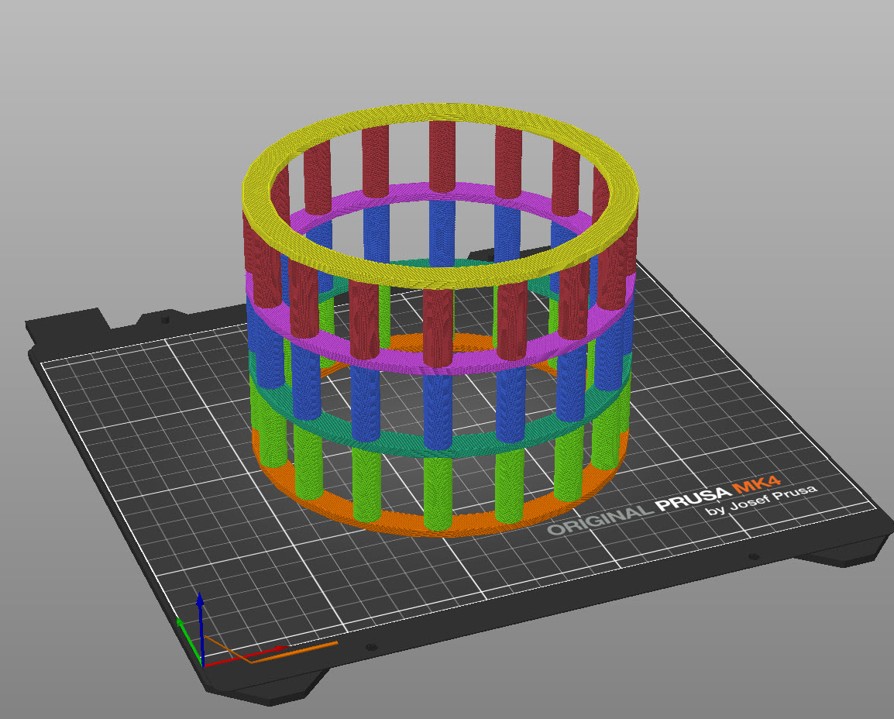
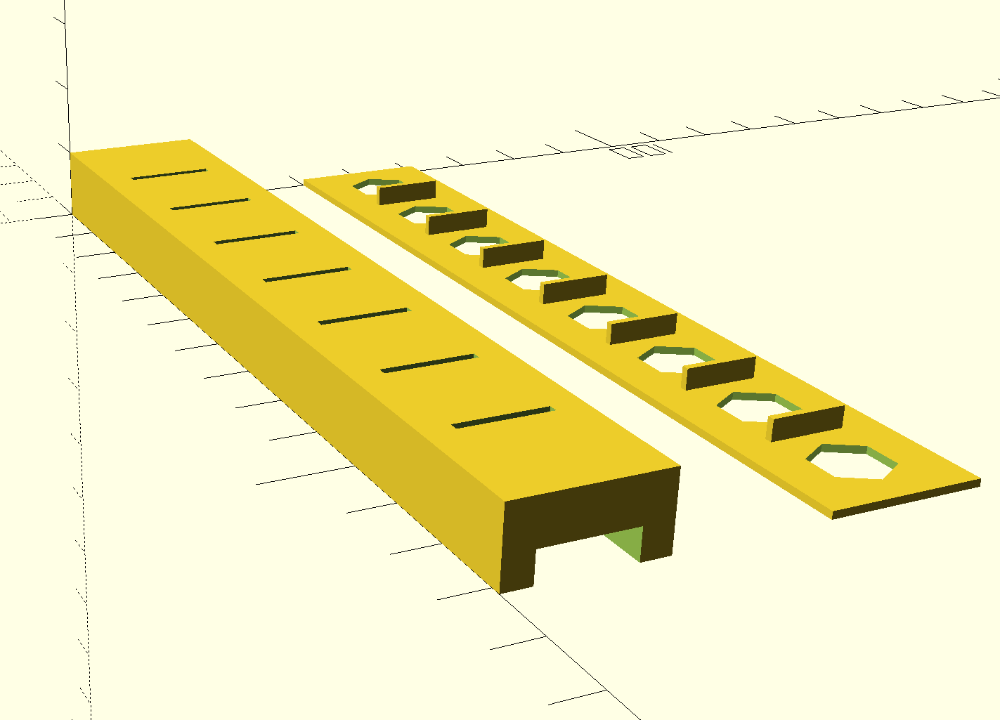
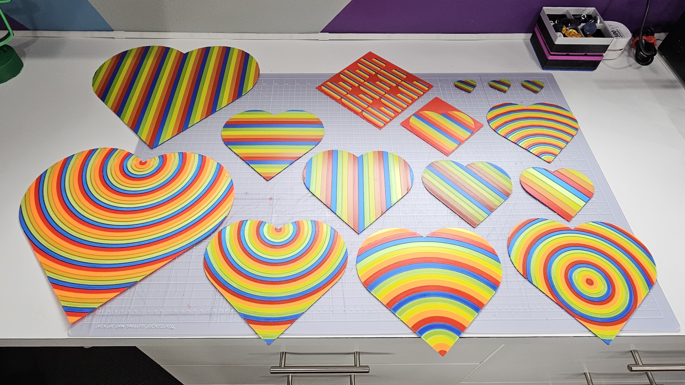
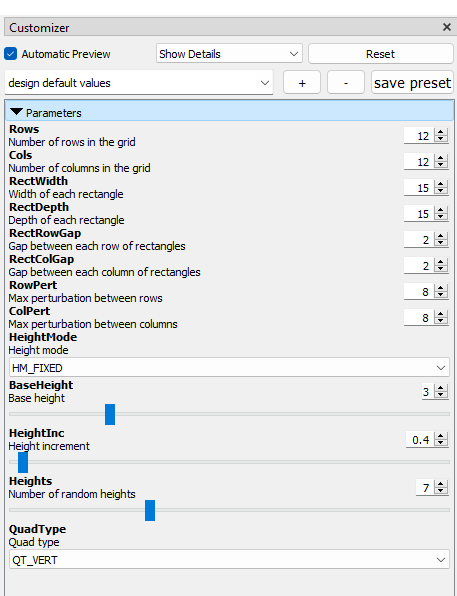
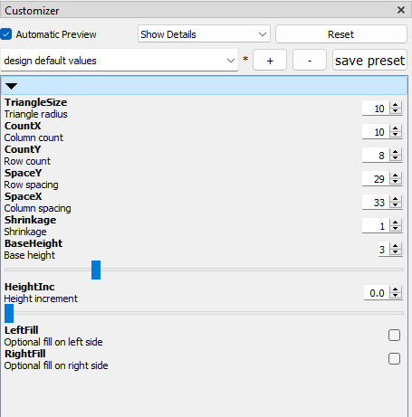
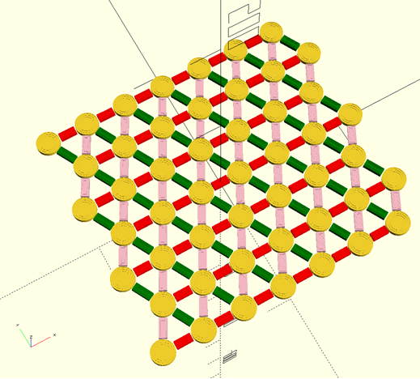
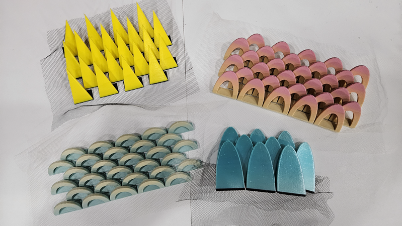
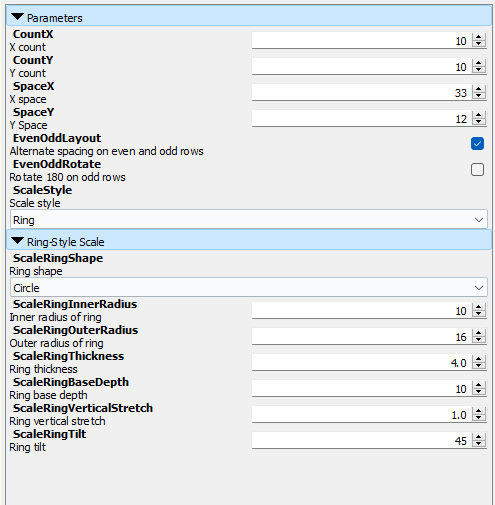
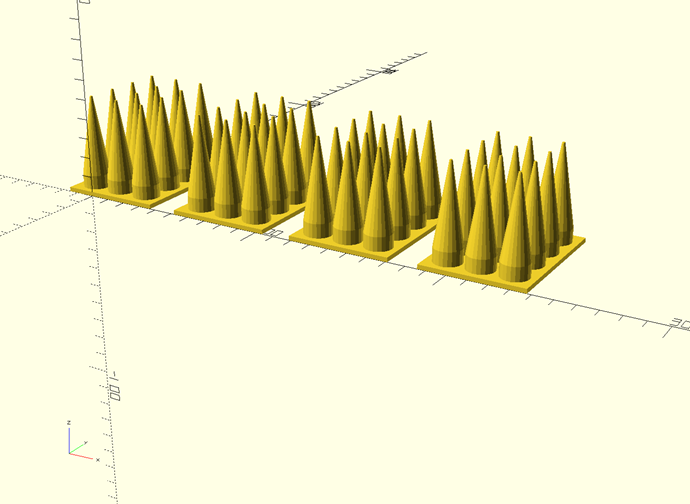
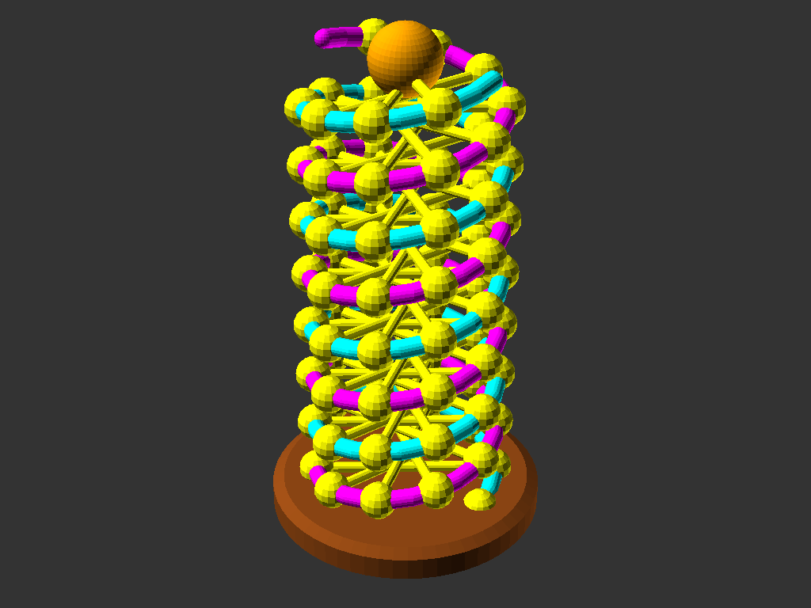

# Introduction
This repository contains a collection of [OpenSCAD](https://openscad.org/) objects that I am developing for my own use. Please check them out and let me know if you find them useful. Pull requests are always welcome!

Here's a review of each one:

* [arcs.scad]
* [aws_fabric_tiles.scad](https://github.com/jeffbarr/OpenSCADObjects#aws_fabric_tilesscad)
* [dentist_square.scad](https://github.com/jeffbarr/OpenSCADObjects#dentist_squarescad)
* [fan_blades.scad]
* [growing_quads.scad]
* [impossible_ring.scad](https://github.com/jeffbarr/OpenSCADObjects#impossible_ringscad)
* [mirror_shapes.scad](https://github.com/jeffbarr/OpenSCADObjects#impossible_ringscad)
* [neo_strip.scad](https://github.com/jeffbarr/OpenSCADObjects#neo_stripscad)
* [nodes_edges.scad](https://github.com/jeffbarr/OpenSCADObjects#nodes_edgesscad)
* [nodes_graph.scad](https://github.com/jeffbarr/OpenSCADObjects#nodes_graphscad)
* polygon.scad
* [pride_hearts.scad](https://github.com/jeffbarr/OpenSCADObjects/blob/main/pride_hearts.scad)
* [quads.scad](https://github.com/jeffbarr/OpenSCADObjects#quadsscad)
* [rhombitrihexagon.scad](https://github.com/jeffbarr/OpenSCADObjects#rhombitrihexagonscad)
* routing_tiles.scad
* [scales.scad](https://github.com/jeffbarr/OpenSCADObjects#scalesscad)
* [spikes.scad](https://github.com/jeffbarr/OpenSCADObjects#spikesscad)
* [super_hexagons.scad](https://github.com/jeffbarr/OpenSCADObjects#super_hexagonsscad)
* [talons.scad](https://github.com/jeffbarr/OpenSCADObjects#talonsscad)
* [truchet_fig19.scad]

## [aws_fabric_tiles.scad](https://github.com/jeffbarr/OpenSCADObjects/blob/main/aws_fabric_tiles.scad)

A tiled grid of [AWS Service Icons](https://github.com/WayneStallwood/AWS-Tile-Generator/tree/main/samples). The STL files from that repo must be in the same directory as this script. Tiles are scaled by *TileScale* and then placed *SpaceX* and *SpaceY* apart, for a total of *CountX* columns and *CountY* rows.

This file is fully customizer-enabled.

## [dentist_square.scad](https://github.com/jeffbarr/OpenSCADObjects/blob/main/dentist_square.scad)

An OpenSCAD replica of an interesting pattern that I found and captured in my dentist's office.

## [impossible_ring.scad](https://github.com/jeffbarr/OpenSCADObjects/blob/main/impossible_ring.scad)

A tower of rings supported by round separators, fully customizer-enabled:

The math for the tilted separators was challenging, here is a diagram:

## [mirror_shapes.scad](https://github.com/jeffbarr/OpenSCADObjects/blob/main/mirror_shapes.scad)

Shapes suitable for embedding mirrors. Work in progress.

## [neo_strip.scad](https://github.com/jeffbarr/OpenSCADObjects/blob/main/neo_strip.scad)

A 2-piece channel and matching cover for Adafruit [NeoPixels](https://www.adafruit.com/category/168), designed to hold the strips tightly and to diffuse the light into a softer glow.

The channel is sized to fit strips within the weatherproof casing;
if you don't plan to use the casing  measure your strips and adjust the values of *SZ* and *SY* to suit.
The cover has a hexagonal hole for each NeoPixel and tabs that snap in to the top of the channel. You can print strips of any length by changing *NN*, subject to the size of your print bed. After you generate (F6) and save (F7) the STL, open it in your slicer,
split the object into two in your slicer and invert the channel (feel free to submit a PR to generate both in the same orientation). In general you will want to print the channel using a transparent color and the cover using an opaque one, but experiment. 

The channels are sized so that they can be butted end-to-end. You can set SB to create a half-slot at the beginning of the channel, and SE to create one at the end. Then you can print a cover that spans channels and holds them together.

Here is the original sketch that led to the design:

## [pride_hearts.scad](https://github.com/jeffbarr/OpenSCADObjects/blob/main/pride_hearts.scad)

A very flexible way to generate Pride-style hearts for multi-extruder printing. Hearts can be printed on an optional base, and in a grid of any size. The hearts can be overlaid with rainbow stripes or concentric circles, with options to control each one. Fully enabled for the OpenSCAD Customizer.

## [quads.scad](https://github.com/jeffbarr/OpenSCADObjects/blob/main/quads.scad)

A rectangle built from a grid of rectangles that are gently and randomly perturbed into quadrilaterals:

Watch this [animation](images/quad_12x12.gif) to see how the values of *RowPert* and *ColPert* affect the generated image. The generated rectangle is a grid measuring *Rows* by *Cols*. Each interior rectangle/quadrilateral-to-be measures *RectDepth* by *RectWidth*, and there's *RectRowGap* / *RectColGap* between each one. The higher that *ColPert* and *RowPert* are, the more perturbed each one will be. Practically, these values should probably be no higher than half of *RectDepth* and *RectWidth*, but nothing will break if you set a higher value. 

The *HeightMode* is used to determine the height of each quadrilatoral, and it can be either "HM_FIXED" to make them all *BaseHeight*, or "HM_RANDOM" to make them any one of *Heights* random heights starting from *BaseHeight* and incrementing by *HeightInc*.

The *QuadType* is used to  the type of each quadrilateral. "QT_VERT" creates simple polygons with vertical sides ([sample](images/quads_sample_vert.png) ), "QT_TAPERED" ([sample](images/quads_sample_taper.png) ) creates simple polygons that taper to 50% of the original width and depth, and "QT_TOPO" creates more complex polyhedra that resemble a topological map ([sample](images/quads_sample_topo.png) ).

This file is fully customizer-enabled, and you can play with all of the options to get a better sense of what this code can do:

## [super_hexagons.scad](https://github.com/jeffbarr/OpenSCADObjects/blob/main/super_hexagons.scad)

A grid of hexagons, each hexagon is made from 6 triangles, each of a different height:

*TriangleSize* controls the size of each triangle, and there are *CountX* columns and *CountY* rows of hexagons. They are spaced by *SpaceX* from column to column, and *SpaceY* from row to row. *Shrinkage* if non-zero is scaling as the triangles get taller. The base height is *BaseHeight*, and step between the 6 heights (one per triangle) is *HeightInc*.  If *LeftFill* is set, the leftmost column has a straight edge. If *RightFill* is set, the rightmost column has a straight edge.

This file is fully customizer-enabled:

## [nodes_edges.scad](https://github.com/jeffbarr/OpenSCADObjects/blob/main/nodes_edges.scad)

Nodes and edges in an offset grid:

*NodeSize* controls the size of each node, and there are *CountX* rows and *CountY* columns of nodes. They are spaced by *SpaceX* from column to column, and *SpaceY* from row to row. *NodeHeight* and *EdgeHeight* set the height of nodes and edges; *NodeRimHeight* and *EdgeRimHeight* do the same for the 3-concentric rim on nodes and edges, each of which is *RimThickness* thick. *EdgeWidth* is the width of each edge. *EdgeLengthXFactor* and *EdgeLengthXYFactor* are percentages that control the length of the X-aligned, and XY diagonal edges. 

Here's a sample in black and silver:

This file is fully customizer-enabled.

## [nodes_graph.scad](https://github.com/jeffbarr/OpenSCADObjects/blob/main/nodes_graph.scad)

A variant of [nodes_edges.scad](https://github.com/jeffbarr/OpenSCADObjects/blob/main/nodes_edges.scad) with more layout flexibility -- circular (and semi-circular) rings of nodes and edges, axial rays that fill out a square or diagonal, and fringe. Still a work in progress.

Sample:

Mostly customizer-enabled, choosing the desired output is accomplished by editing the code.

## [scales.scad](https://github.com/jeffbarr/OpenSCADObjects/blob/main/scales.scad)

All kinds of scales:

*CountX* and *CountY* set the number of scales in the X and Y direction, spaced *SpaceX* and *SpaceY* apart. If *EvenOddLayout* is set, scales on odd values of Y are offset by *SpaceX* / 2. If *EvenOddRotate* is set, those scales are rotated 180 degrees on the Z axis. 

The only supported *ScaleStyle* is "Ring". Within that, *ScaleRingShape* can be "Circle", "Triangle", "Hexagon", or "Octagon". The remaining parameters in this section control the size and thickness of each ring.

Fully customizer-enabled:

## [spikes.scad](https://github.com/jeffbarr/OpenSCADObjects/blob/main/spikes.scad)

Spikes on rafts:

*_RaftCount* sets the number of rafts, each one separated by *_RaftSpaceX* and *_Raftheight* thick. Each raft has a grid of *_SpikeCountX* by *_SpikeCountY* spikes, and each spike is *_SpikeCylHeight* + *_SpikeTipHeight* high. Spikes can be cylindrical or pyramidal. Each cylindrical spike is *_SpikeRadius* around. Each pyramidal spike is on a square base *_PyrBase* wide and deep, and *_PyrHeight* tall, ith walls *_PyrWall* thick. Spikes of either type are spaced on the raft based on *_SpikeSpaceX* and *_SpikeSpaceY*. 

This file is fully customizer-enabled.

## [rhombitrihexagon.scad](https://github.com/jeffbarr/OpenSCADObjects/blob/main/rhombitrihexagon.scad)

A [Rhombitrihexagon](https://en.wikipedia.org/wiki/Rhombitrihexagonal_tiling):

One input value (*_HexRadius*) controls the size of all of the elements in the XY plane. The heights of the hexagons, squares, and triangles can be set individually. Read [this post](https://medium.com/@nextjeff/3d-printing-rhombitrihexagons-d9aa5c4a1251) to learn more about the code.

## [talons.scad](https://github.com/jeffbarr/OpenSCADObjects/blob/main/talons.scad)

A grid or ring of talons, fully Customizer enabled, lots of parameters.

Here's the Customizer:

There are two layouts, *Grid* and *Ring*. If *SolidBase* is set, then talons are on a solid base that is *BaseThickness* high. Grid bases surround the talon grid with a border that is *BaseBorder* wide. Ring bases consist of a ring that has *RingBaseOuterRadius*, with a *RingBaseInnerRadius* hole in the center. Each talon is the intersection of two arcs of  *TalonRadius* , with the arcs separated by *TalonOffset*, and each talon *TalonThickness* wide. Talons are rotated by *TalonRotation*, with additional rotation for Ring bases.

Grid bases have *CountX* by *CountY* talons, spaced *SpaceX* and *SpaceY* apart, with talons on odd rows centered between those on even rows.

Ring bases have the primary ring of *MainRingTalonCount* talons at *MainFirstRingRadius*, then stepped by *MainRingRadiusStep* for *MainRingCount* times. There's also a secondary "fill" ring of *FillRingTalonCount* talons, starting at *FillFirstRingRadius*, then stepped by *FillRingRadiusStep* for *FillRingTalonCount* times. The ring itself is rotated by *FillRingRotate*.

---

# Community Contributions

The following designs were contributed by the community and demonstrate creative applications of OpenSCAD parametric design, multi-color printing, and advanced 3D printing techniques.

## [dna_helix_lamp.scad](https://github.com/jeffbarr/OpenSCADObjects/blob/main/dna_helix_lamp.scad)

*Contributed by: [@Seblat5ch](https://github.com/Seblat5ch)*

A decorative double helix structure inspired by DNA, perfect for LED strip lighting or as a decorative lamp. Two intertwined spiral strands are connected by nodes, creating an elegant parametric design based on helix mathematics. Now includes collapsible design with fabric joints for compact storage!

The design uses parametric helix equations: `x(t) = r × cos(θ)`, `y(t) = r × sin(θ)`, `z(t) = h × t`, where `θ = t × 360° × num_turns + offset`. The second strand is 180° out of phase, creating the characteristic double helix structure.

**Development Process:**
This design was created using AI-assisted development with Amazon Kiro IDE and Claude. The process involved:
1. Analyzing Jeff's existing OpenSCAD designs to understand his parametric design patterns and multi-extruder color system
2. Implementing helix mathematics for the double-strand spiral structure
3. Creating smooth connections between nodes using hull() operations
4. Adding full Customizer support for all parameters
5. Designing a hollow base suitable for LED strip integration

**Key Features:**
- Fully parametric with extensive customization options
- Hollow base for LED wiring
- Decorative base with configurable pattern
- Adjustable helix dimensions, strand thickness, and node count
- Optional top cap
- Smooth curves using hull() connections

**Customizable Parameters:**
- *Height*: Total height of the lamp (50-400mm)
- *HelixRadius*: Radius of the spiral (20-100mm)
- *NumTurns*: Number of complete rotations (1-10)
- *StrandThickness*: Thickness of DNA strands (2-10mm)
- *NodeSize*: Size of connecting nodes (4-15mm)
- *NumNodes*: Number of connecting nodes (10-100)
- *BaseHeight* and *BaseRadius*: Base dimensions
- *BasePatternCount*: Number of decorative elements on base
- *EnableTopCap*: Toggle top sphere

This file is fully customizer-enabled. Perfect for 3D printing with multi-color filament or as a decorative piece.

## [fabric_honeycomb_skep.scad](https://github.com/jeffbarr/OpenSCADObjects/blob/main/fabric_honeycomb_skep.scad)

*Contributed by: [@Seblat5ch](https://github.com/Seblat5ch)*

A collapsible honeycomb beehive skep designed for fabric printing using Jeff Barr's [fabric printing technique](https://nextjeff.com/3d-printing-on-fabric-tips-and-tricks-f306f4d56833). The design combines rigid honeycomb sections with flexible fabric joints, creating a structure that can collapse and expand.

**Key Features:**
- Collapsible design with fabric joints between rigid honeycomb sections
- Fabric attachment lips and registration marks for precise alignment
- Multi-color support using Jeff's extruder system (4 colors: base, honeycomb, marks, knob)
- Parametric honeycomb pattern and entrance hole
- Fully customizer-enabled

**Fabric Printing Process:**
Print each section, pause at boundaries, insert tulle/mesh fabric using registration marks, resume printing to embed fabric. The fabric creates flexible joints allowing the structure to collapse and expand.

**Development:**
Created using AI-assisted development with Amazon Kiro IDE and Claude, studying Jeff's fabric printing technique and multi-extruder color system to combine collapsible design with fabric integration.

**Multi-Color Export:**
Set `_WhichExtruder` to 1-4 to export separate STL files per color, then import into your slicer and assign filaments.

---

## Development Tools

The community contributions above were developed using:

**[OpenSCAD MCP Server](https://github.com/Seblat5ch/OpenSCAD-MCP-Server)** - A Model Context Protocol (MCP) server that enables AI-assisted 3D model generation and OpenSCAD code development. My fork adds AWS Bedrock Nova Canvas integration with support for both API key and credential-based authentication. Features include:
- AI-powered image generation using AWS Bedrock Nova Canvas
- Multi-view image generation for 3D reconstruction
- Integration with OpenSCAD for parametric model generation
- Flexible authentication: AWS credentials or Bedrock API keys
- Python 3.13 compatibility on Windows

**[Kiro IDE](https://kiro.dev/)** - An AI-powered development environment that integrates with MCP servers to provide intelligent code assistance, pattern recognition, and iterative design refinement.

**Claude 4.5 Sonnet (Anthropic)** - AI assistant used for code generation, mathematical calculations, and design iteration.

This workflow demonstrates how AI-assisted development tools can help create complex parametric designs by analyzing existing code patterns, implementing mathematical concepts, and iterating on design requirements.
